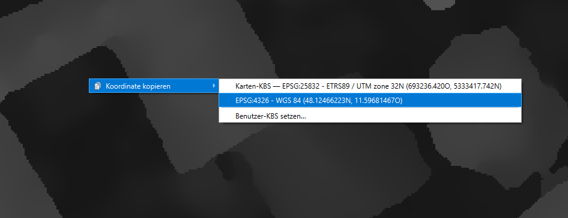
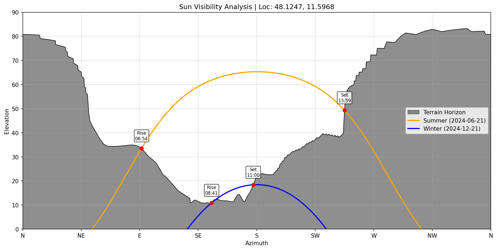
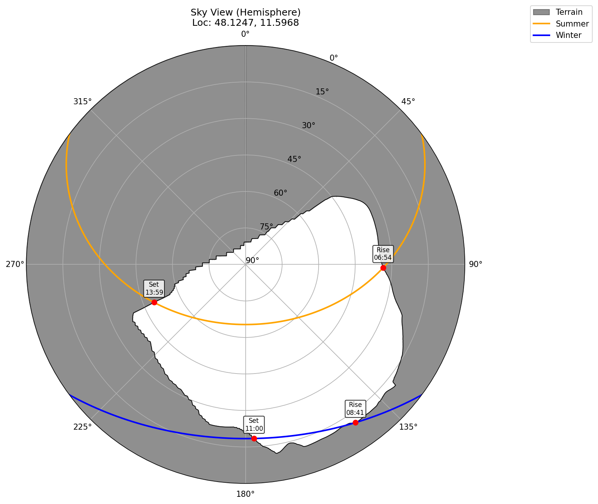

# dem-to-sunshine

## Installation
Install the required packages:
```shell
pip install rasterio numpy matplotlib pandas astropy pyproj tyro scipy
```

Then clone and `cd`:
```
git clone https://github.com/lwiniwar/dem-to-sunshine.git
cd dem-to-sunshine
```

## Download raster files
e.g. from
https://geodaten.bayern.de/opengeodata/OpenDataDetail.html?pn=dom20 (for Bavaria)
or
https://tiris.maps.arcgis.com/apps/webappviewer/index.html?id=5e3071044cb44e76843d110baef8b138 (for Tyrol)

## Locate the POI
I do this by opening the DEM in [QGIS](https://www.qgis.org/download/) and right-clicking on the location I want to query -> "Copy coordinates" -> "WGS84"


## Running the tool
run using

```shell
python main.py --args.dem-path demo/32693_5333_20_DOM.tif --args.lat 48.12466249 --args.lon 11.59677922 --args.height-above-ground 7.3 --args.output-prefix muc ---args.angular-res-deg 0.25
```

(adapting parameters as needed).

## Output 

The results may look like this:





```
--- 1. Terrain Analysis ---
Loading DEM: demo\32693_5333_20_DOM.tif...
Observer Elevation: 532.0m (Ground) + 7.3m (Eye) = 539.3m
Calculating terrain occlusion mask...
--- 2. Calculating Solstice Paths ---
Plot saved to muc_plot.png
--- 3. Calculating Annual Statistics (Full Year Simulation) ---
Simulating full year sun positions (this takes a moment)...

--- Monthly Mean Daily Sunshine (Hours) ---
Month  Theoretical Mean (hrs)  Actual Mean (hrs)  Mean Loss (hrs)  Mean Loss (%)
  Jan                    8.68               3.03             5.65           65.1
  Feb                   10.06               4.76             5.30           52.7
  Mar                   11.78               5.95             5.83           49.5
  Apr                   13.52               7.03             6.49           48.0
  May                   15.03               7.45             7.58           50.4
  Jun                   15.81               7.37             8.44           53.4
  Jul                   15.38               7.48             7.90           51.3
  Aug                   14.06               7.30             6.76           48.1
  Sep                   12.37               6.38             5.99           48.5
  Oct                   10.62               5.12             5.51           51.8
  Nov                    9.05               3.63             5.42           59.9
  Dec                    8.24               2.38             5.86           71.1

Statistics saved to muc_stats.csv
```

